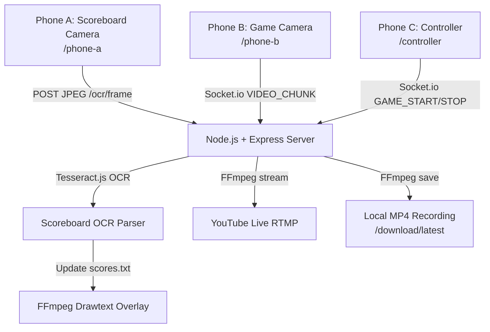

# CourtCast — Basketball Live Broadcast App

CourtCast is a full-stack web application that transforms two smartphones into a live TV-style basketball broadcast system, complete with a real-time scoreboard overlay streamed to YouTube Live—all 100% free and without local computer hardware constraints.

## System Architecture



1. **Phone A (/phone-a)** captures the scoreboard, crops the scoreboard region to the configured bounds, and POSTs cropped JPEGs every 2 seconds to `POST /ocr/frame`.
2. **The Server** runs Tesseract.js locally on the cropped frame, parses the text to extract the scoreboard state (Scores, Clock, Quarter, Fouls, Timeouts), and broadcasts `SCORE_UPDATE` to all devices.
3. **Phone B (/phone-b)** streams live video chunks (250ms chunks) to the server via Socket.io.
4. **The Server** pipes the incoming video to an active FFmpeg process, applies dynamic overlays (burning the scoreboard banner into the video), and simultaneously streams to YouTube Live (via RTMP) and saves it as a local MP4 file.
5. **The Controller (/controller)** acts as the referee's dashboard, showing camera connection statuses, start/stop buttons, a live scoreboard monitor, and download links.

---

## Local Development & Setup

### Prerequisites
- [Node.js](https://nodejs.org/) (v16+) installed.
- [ngrok](https://ngrok.com/) installed (to expose local server to internet for camera access on smartphones).
- FFmpeg is handled automatically by the project! The server installs `ffmpeg-static` to run self-contained.

### Installation
Clone the repository and run the installation script in the root directory:
```bash
# Install root, server, and client dependencies
npm install
npm run install-all
```

### Running Locally
1. **Start the development servers**:
   ```bash
   # Runs server on port 3001 and client on port 3000 (with dev proxy)
   npm run dev
   ```
2. **Expose the backend via ngrok**:
   Open a separate terminal and expose the backend port:
   ```bash
   ngrok http 3001
   ```
   *Note: Copy the `https://...` ngrok URL. Secure HTTPS is REQUIRED by mobile browsers to access cameras.*

3. **Configure & Scan**:
   - Open `<ngrok-url>/setup` on your computer.
   - Scan the QR code for **Phone A** and **Phone B** with their respective smartphones.
   - Adjust the crop region in `/setup` to focus on the scoreboard.
   - Open `<ngrok-url>/controller` on your controller phone.
   - Press **START** to begin broadcasting!

---

## Hosting on Remote Cloud Servers (No Computer at Venue)

To use CourtCast at the venue without carrying a laptop, you can deploy the server to a cloud provider like **Render**, **Heroku**, or a **Linux VPS**.

### 1. Unified Production Build
Vite will compile the React client into a static production bundle that the Express server serves directly.
```bash
# Build the client bundle
npm run build-client
```
The server will automatically detect the build at `client/dist/` and serve it. This allows you to host the backend and frontend together on a single port.

### 2. Deployment Steps (e.g., Render)
1. Push this repository to your GitHub account.
2. Create a new **Web Service** on Render.
3. Connect your GitHub repository.
4. Set the following configurations:
   - **Build Command**: `npm install && npm run install-all && npm run build-client`
   - **Start Command**: `npm start --prefix server`
5. Render will build the React client and start the Node.js server. The service will be exposed on a secure HTTPS URL (e.g. `https://courtcast.onrender.com`).
6. Access `https://<your-app>.onrender.com/setup` from any device at the game!

*Note for Linux servers*: The server is configured to automatically fall back to standard Linux fonts (DejaVuSans, LiberationSans) if Windows Arial is not available, keeping the overlay text rendering stable on cloud platforms.

---

## Game Workflow

1. **Physical Setup**:
   - Place **Phone A** on a tripod facing the scoreboard.
   - Place **Phone B** on a tripod or gimbal to record the court action.
2. **Alignment & Crop**:
   - Open `/phone-a` on Phone A.
   - Open `/setup` on another screen. You will see Phone A's live feed.
   - Drag a selection box over the scoreboard. Make sure it isolates the numbers (scores, clock, fouls, timeouts).
   - Click **Save Configuration**. Phone A will receive the coordinates, crop its frames, and begin sending 2s OCR updates.
3. **Stream Management**:
   - Open `/controller` on your phone.
   - Check that Phone A and Phone B show green status dots.
   - Tap **START**. Phone B will begin capturing video, and FFmpeg will start compiling the stream.
4. **Post-Game**:
   - Tap **STOP** on the controller. FFmpeg closes gracefully.
   - Tap **Download MP4 Video** to download the completed high-quality recording directly to your phone.
